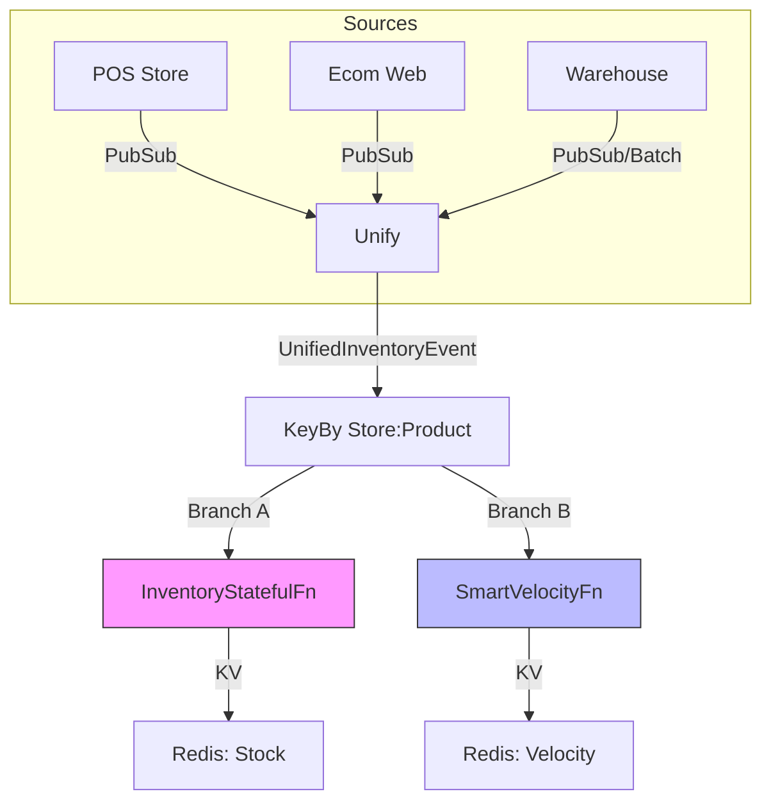

# Beamlytics Streamlytics: Real-Time Omnichannel Signal Platform

## Introduction
Beamlytics Streamlytics is a high-performance **Real-Time Data Processing Platform** designed to bridge the gap between physical retail stores and digital ecommerce channels. It ingests thousands of events per second—from Point-of-Sale (POS) systems, Warehouse Management Systems (WMS), and Web Clickstreams—to generate **accurate, sub-second inventory signals** and **consumer urgency metrics**.

## Problem Statement
Modern retailers face three critical challenges in unifying their data:
1.  **Disconnected Streams**: POS sales, warehouse receipts, and web clicks arrive via different pipelines with varying latencies, making it impossible to get a "Single View of Inventory".
2.  **State Inconsistency**: Physical inventory counts ("Resets") happen periodically. Traditional streaming pipelines cannot easily handle these "hard resets" or correctly drop late data that predates a reset, leading to "Phantom Inventory".
3.  **Variable Latency**: Web data is real-time; Store data is often batched (hourly/daily). A static 1-hour window for calculating "Sales Velocity" works for web but fails for stores, and vice versa.

## Solution and Architecture
We implemented a **Unified Stateful Architecture** using Apache Beam to solve these problems.

### Core Architecture
The system utilizes a **Stateful Unified Processing Model** that forks into two intelligent branches:



### Key Components
1.  **Unified Input Layer**: Ingests `SALE`, `RECEIPT`, `RESET`, `VIEW`, and `CART_ADD` events into a common `UnifiedInventoryEvent`.
2.  **InventoryStatefulFn (Branch A)**:
    -   Maintains strict "Current On-Hand" state.
    -   **Reset Barrier**: Automatically updates state on `RESET` events and **drops** any late transactions that occurred before the reset timestamp, ensuring 100% accuracy.
3.  **SmartVelocityFn (Branch B)**:
    -   Calculates "Urgency" (e.g., "50 sold in last hour").
    -   **Dynamic Windowing**: automatically switches between **1-Hour** (Real-Time) and **24-Hour** (Batch/Slow) windows based on traffic density and accumulated velocity.
4.  **Redis Serving Layer**:
    -   Delivers sub-millisecond signals to the storefront.
    -   Keys: `velocity:global:{product}:1hr` (Global Urgency), `stock:{store}:{product}` (Local Stock).

## Business Benefits
-   **Increased Conversion**: Show real-time "High Demand" or "Low Stock" badges (`VIEW` + `CART` signals) to drive urgency.
-   **Operational Integrity**: "Inventory Resets" are handled natively, preventing overselling of phantom stock.
-   **Omnichannel Visibility**: Unified view of sales across valid real-time Web events and delayed Store events.
-   **Cost Efficiency**: Smart windowing reduces noise for slow-moving products while capturing bursts for trending items.

## Technology Stack
-   **Compute**: Apache Beam (Google Dataflow runner compatible).
-   **Language**: Java 17.
-   **Streaming Sources**: Google Pub/Sub.
-   **Serving Layer**: Redis (Memorystore).
-   **Data Warehousing**: Google BigQuery.

## Running the Project
See `walkthrough.md` for detailed instructions on running the local Dockerized stack.

```bash
# Build
mvn clean package

# Run with Local Docker Stack
docker-compose up -d
./setup_pubsub.sh
```
